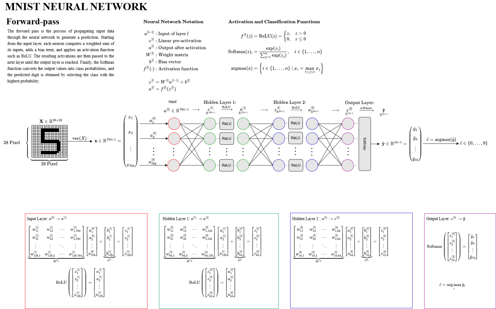
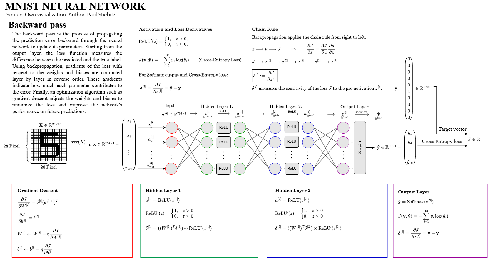

# Neural Network - MNIST Classifier

A feedforward neural network written in C that trains and evaluates on the [MNIST](http://yann.lecun.com/exdb/mnist/) handwritten digit dataset.

---

## Architecture

| Layer | Type | Size | Activation |
|---|---|---|---|
| Input | - | 784 (28x28 flattened) | - |
| Hidden 1 | Fully connected | 128 neurons | ReLU |
| Hidden 2 | Fully connected | 64 neurons | ReLU |
| Output | Fully connected | 10 neurons | Softmax |

- **Loss:** Cross-entropy
- **Optimiser:** SGD with gradient clipping (L2-norm ≤ 1.0)
- **Learning rate:** 0.01
- **Epochs:** 10
- **Weight init:** Uniform random in `[-0.05, 0.05]`
- **Training shuffle:** Fisher-Yates per epoch

---

## Forward Pass



---

## Backward Pass



---

## Project Structure

| File | Description |
|---|---|
| `main.c` | Entry point: load data, build, train, test |
| `libs/libidx3/idx3_io.h/.c` | IDX file reader, endian conversion |
| `libs/matrix/matrix.h/.c` | Vector, Matrix, LabeledMatrix types and math |
| `libs/nn/nn.h/.c` | Forward pass, backward pass, weight updates |

---

## Build

```bash
gcc -o nn main.c libs/matrix/matrix.c libs/libidx3/idx3_io.c libs/nn/nn.c -lm
```

---

## Data Setup

Download the MNIST dataset from <http://yann.lecun.com/exdb/mnist/> and place the unzipped files as follows:

```
data/training/train-images.idx3-ubyte
data/training/train-labels.idx1-ubyte
data/testing/t10k-images.idx3-ubyte
data/testing/t10k-labels.idx1-ubyte
```

---

## Run

```bash
./nn
```

The program prints the first 10 images as binary pixel maps, logs training progress per epoch, and prints final test accuracy.
